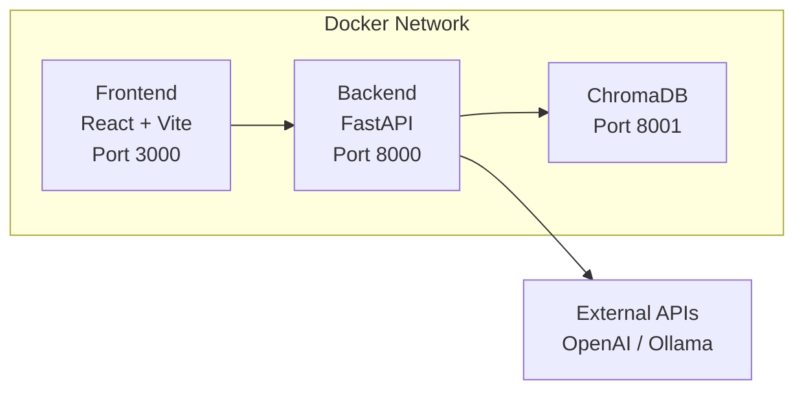

# Architecture Document - DocChat

**Status:** Draft  
**Version:** 0.1  
**Last updated:** 2026-04-17

---

## 1. Overview

DocChat is a multi-container application orchestrated with Docker Compose. It consists of three services: a React frontend, a FastAPI backend, and a ChromaDB vector store. Configuration and uploaded files are persisted via Docker volumes.



---

## 2. Tech Stack

| Layer | Technology | Reason |
|---|---|---|
| Frontend | React 18 + Vite | Fast dev experience, ecosystem |
| UI Components | shadcn/ui + TailwindCSS | Accessible, unstyled base + utility classes |
| Backend API | FastAPI + Python 3.11 | Async-native, auto-docs, type validation |
| Data validation | Pydantic v2 | Integrated with FastAPI, strict typing |
| Vector store | ChromaDB | Simple, local, persistent, no infra overhead |
| File parsing | pdfplumber, python-docx, built-in | Per format, battle-tested |
| HTTP client | httpx | Async, used for URL ingestion and LLM calls |
| LLM providers | OpenAI API, Ollama | Primary + local fallback |
| Config storage | JSON file on disk | Simple, no DB dependency for settings |
| File storage | Local filesystem | Uploaded sources kept after ingestion |
| Container | Docker + Docker Compose | Single-command deployment |

---

## 3. Project Structure

```text
docchat/
  docker-compose.yml
  .env.example                  # ports, volume paths only - no secrets

  frontend/
    Dockerfile
    src/
      components/
        chat/
        sources/
        projects/
        settings/
      pages/
        ChatPage.tsx
        ProjectPage.tsx
        SettingsPage.tsx
      hooks/
      lib/
      main.tsx
    package.json

  backend/
    Dockerfile
    requirements.txt
    main.py                     # FastAPI app entrypoint
    config.py                   # settings.json read/write
    api/
      projects.py               # CRUD projects
      sources.py                # ingestion, list, delete
      chat.py                   # RAG + streaming
      settings.py               # provider config, model selection
    services/
      ingestion.py              # parsing -> chunking -> embedding -> store
      retrieval.py              # vector search
      llm.py                    # LLM provider abstraction (OpenAI / Ollama)
      embeddings.py             # embedding provider abstraction
      parsers/
        pdf.py
        docx.py
        text.py
        csv.py
        url.py
    data/
      settings.json             # persisted via Docker volume
      uploads/                  # persisted via Docker volume
```

---

## 4. Data Model

### 4.1 settings.json

```json
{
  "provider": "openai",
  "openai_api_key": "sk-proj-ABC...XYZ",
  "ollama_url": null,
  "chat_model": "gpt-4o-mini",
  "embedding_model": "text-embedding-3-small"
}
```

> `openai_api_key_display` is generated by the API response and is not persisted in `settings.json`.

### 4.2 Project

Stored as ChromaDB collection metadata + a lightweight JSON index.

```json
{
  "id": "uuid",
  "name": "Company Handbook",
  "description": "HR and internal policies",
  "created_at": "2026-04-16T10:00:00Z"
}
```

### 4.3 Source

```json
{
  "id": "uuid",
  "project_id": "uuid",
  "name": "onboarding_2024.pdf",
  "type": "pdf",
  "description": "Employee onboarding guide for new hires",
  "content_hash": "sha256:abc123...",
  "chunk_count": 42,
  "file_path": "data/uploads/uuid.pdf",
  "created_at": "2026-04-16T10:00:00Z"
}
```

### 4.4 ChromaDB Chunk (metadata per chunk)

```json
{
  "chunk_id": "uuid",
  "source_id": "uuid",
  "project_id": "uuid",
  "source_name": "onboarding_2024.pdf",
  "source_description": "Employee onboarding guide for new hires",
  "page": 3
}
```

---

## 5. API Routes

### Projects
| Method | Route | Description |
|---|---|---|
| GET | `/api/projects` | List all projects |
| POST | `/api/projects` | Create a project |
| PATCH | `/api/projects/{id}` | Rename a project |
| DELETE | `/api/projects/{id}` | Delete project + all its data |

### Sources
| Method | Route | Description |
|---|---|---|
| GET | `/api/projects/{id}/sources` | List sources for a project |
| POST | `/api/projects/{id}/sources` | Create ingestion job (file upload or URL) |
| GET | `/api/projects/{id}/sources/jobs/{job_id}/events` | Stream ingestion progress events (SSE) |
| DELETE | `/api/projects/{id}/sources/{source_id}` | Delete a source |

### Chat
| Method | Route | Description |
|---|---|---|
| POST | `/api/chat` | Send a message, returns SSE stream |

### Chat SSE Contract (`POST /api/chat`)

The chat endpoint streams responses using Server-Sent Events with `Content-Type: text/event-stream`.

Event types and payloads:

- `event: start`
  - `{ "provider": "openai|ollama", "model": "...", "context_truncated": true|false }`
- `event: token`
  - `{ "delta": "partial generated text" }`
- `event: citation`
  - `{ "source_id": "uuid", "source_name": "...", "chunk_id": "uuid", "page": 3, "excerpt": "...", "score": 0.87 }`
- `event: usage`
  - `{ "prompt_tokens": 123, "completion_tokens": 456, "total_tokens": 579, "estimated_cost_usd": 0.0012 }`
  - If unavailable for a request, `estimated_cost_usd` is `null`.
- `event: error`
  - `{ "code": "provider_error|timeout|rate_limited|validation_error", "message": "...", "retryable": true|false }`
- `event: done`
  - `{ "finish_reason": "stop|length|error", "latency_ms": 1234 }`

Expected order:

- Normal flow: `start` -> `token*` -> `citation*` -> `usage?` -> `done`
- Streaming failure: `start` -> `token*` -> `error` (connection closes)
- Request validation failure: regular HTTP `4xx` JSON response (no SSE stream starts)

### Settings
| Method | Route | Description |
|---|---|---|
| GET | `/api/settings` | Get current config (masked API key) |
| PUT | `/api/settings/provider` | Save provider config |
| GET | `/api/settings/providers/{provider}/models` | Scan and return available models for a given provider |
| GET | `/api/settings/status` | Projects count, sources count, storage used |
| GET | `/api/settings/usage` | Token consumption + estimated cost |

---

## 6. Key Flows

### 6.1 Ingestion Pipeline

1. User submits a file or URL to `POST /api/projects/{id}/sources`.
2. Backend validates input, creates an ingestion job, and returns `{ "job_id": "...", "status": "queued" }`.
3. Frontend subscribes to `GET /api/projects/{id}/sources/jobs/{job_id}/events` (SSE).
4. Backend computes `content_hash` and checks duplicates within the project.
5. If duplicate is found, backend emits `replace_available` and marks job as completed without re-indexing.
6. If not duplicate, backend parses content, chunks text, generates embeddings, stores vectors in ChromaDB, and saves source metadata.
7. Backend emits progress events throughout the job (for example: `queued`, `parsing`, `chunking`, `embedding`, `storing`, `completed`, `failed`).
8. On completion, backend emits a final payload such as `{ "status": "completed", "chunk_count": 42, "source_name": "onboarding_2024.pdf" }`.

### 6.2 RAG Query Pipeline

1. Frontend sends user message and conversation history.
2. Backend embeds the question using the configured embedding provider.
3. Backend performs vector search in ChromaDB (`collection = project_id`, `top_k = 5`).
4. Backend builds the prompt from system instructions, retrieved chunks, and conversation window.
5. Backend calls the selected LLM provider (OpenAI or Ollama) in streaming mode.
6. Backend streams generated tokens to the frontend via SSE.

### 6.3 Conversation Context Management

- Conversation history is kept in frontend state (not persisted)
- On each message, the full history is sent to the backend in the request body
- Backend applies a sliding window: if total tokens (history + chunks + question) exceed the model's context limit, oldest messages are dropped
- When messages are dropped, the backend includes a flag in the response: `context_truncated: true`
- Frontend displays a subtle notice when this flag is received

### 6.4 Ingestion Limits

- Maximum uploaded file size: `50 MB` per file
- Maximum fetched page size for URL ingestion: `50 MB`
- URL ingestion timeout: `30 seconds`
- Maximum redirects for URL ingestion: `5`
- Accepted URL schemes: `http` and `https`

---

## 7. Provider Abstraction

Both `llm.py` and `embeddings.py` expose a unified interface so the rest of the codebase is provider-agnostic.

```python
# llm.py
async def stream_chat(messages: list, model: str) -> AsyncIterator[str]:
    if provider == "openai":
        # call OpenAI chat completions API
    elif provider == "ollama":
        # call Ollama /api/chat

# embeddings.py
async def embed(texts: list[str], model: str) -> list[list[float]]:
    if provider == "openai":
        # call OpenAI embeddings API
    elif provider == "ollama":
        # call Ollama /api/embeddings
```

---

## 8. Docker Compose

```yaml
services:
  frontend:
    build: ./frontend
    ports:
      - "${FRONTEND_PORT:-3000}:3000"
    depends_on:
      - backend

  backend:
    build: ./backend
    ports:
      - "${BACKEND_PORT:-8000}:8000"
    volumes:
      - docchat_data:/app/data
    depends_on:
      chromadb:
        condition: service_healthy

  chromadb:
    image: chromadb/chroma:0.5.5
    ports:
      - "8001:8001"
    volumes:
      - chroma_data:/chroma/chroma
    healthcheck:
      test: ["CMD", "python", "-c", "import urllib.request; urllib.request.urlopen('http://localhost:8001/api/v1/heartbeat')"]
      interval: 10s
      timeout: 5s
      retries: 5
      start_period: 10s

volumes:
  docchat_data:    # settings.json + uploaded files
  chroma_data:     # vector store
```

> `.env` contains only `FRONTEND_PORT` and `BACKEND_PORT`. No secrets.

---

## 9. Security & Trust Boundaries

### 9.1 Trust Boundaries

- `Client -> Backend API`: browser inputs are untrusted and validated server-side
- `Backend API -> Local Storage`: only backend services can read/write `data/` and update ChromaDB
- `Backend API -> External Providers`: OpenAI/Ollama calls are treated as external dependencies and handled with explicit timeouts/errors
- `Backend API -> URL Sources`: remote web content is untrusted and processed through constrained ingestion rules

### 9.2 Security Rules (v1)

- No built-in authentication in v1; deployment is protected at network level
- CORS uses an explicit frontend-origin allowlist (no wildcard `*`)
- File ingestion validates extension + MIME type + file signature before parsing
- Uploaded paths are backend-generated (UUID-based); user-provided filenames are never used as filesystem paths
- Path traversal protection is enforced by resolving paths and verifying they stay under `data/uploads/`
- API key is never returned in clear text; settings responses expose only a masked representation

---

## 10. Key Design Decisions

| Decision | Choice | Reason |
|---|---|---|
| One ChromaDB collection per project | Adopted | Clean isolation, simple to delete, no cross-project bleed |
| Config stored as JSON | Adopted | Zero dependency, sufficient for a single-node deployment |
| Files kept after ingestion | Adopted | Allows re-ingestion if embedding model changes |
| History managed client-side | Adopted | No persistence requirement, simplifies backend |
| Sliding window for context | Adopted | Simple, predictable, honest to the user |
| Provider abstraction layer | Adopted | OpenAI and Ollama swappable without touching RAG logic |

---

*This document describes the v1 architecture. It is intended to evolve alongside the PRD.*
